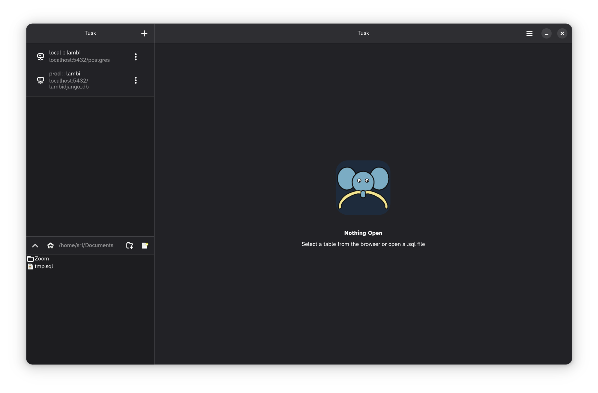
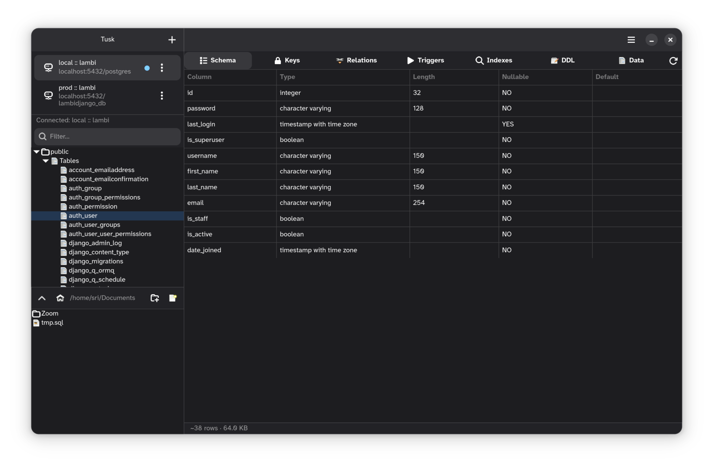
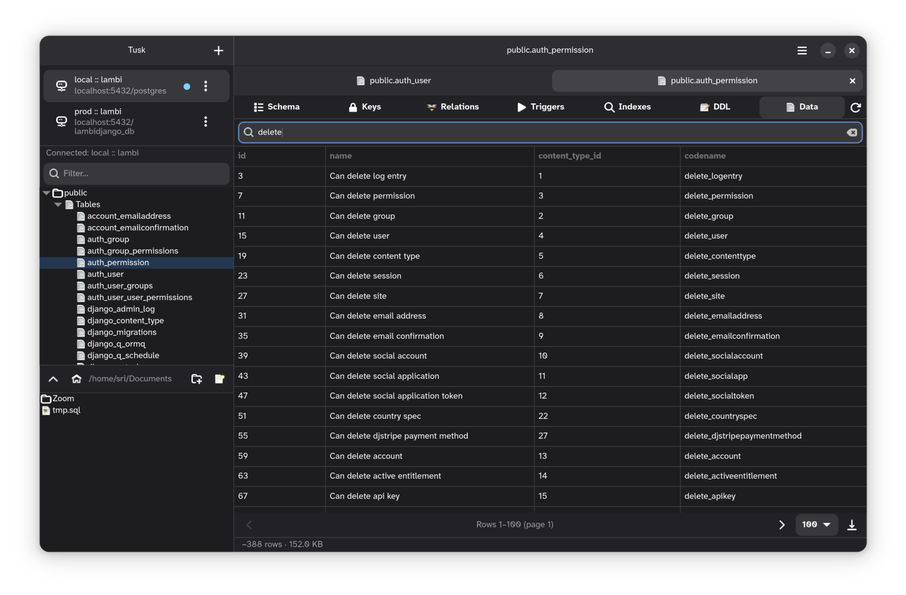
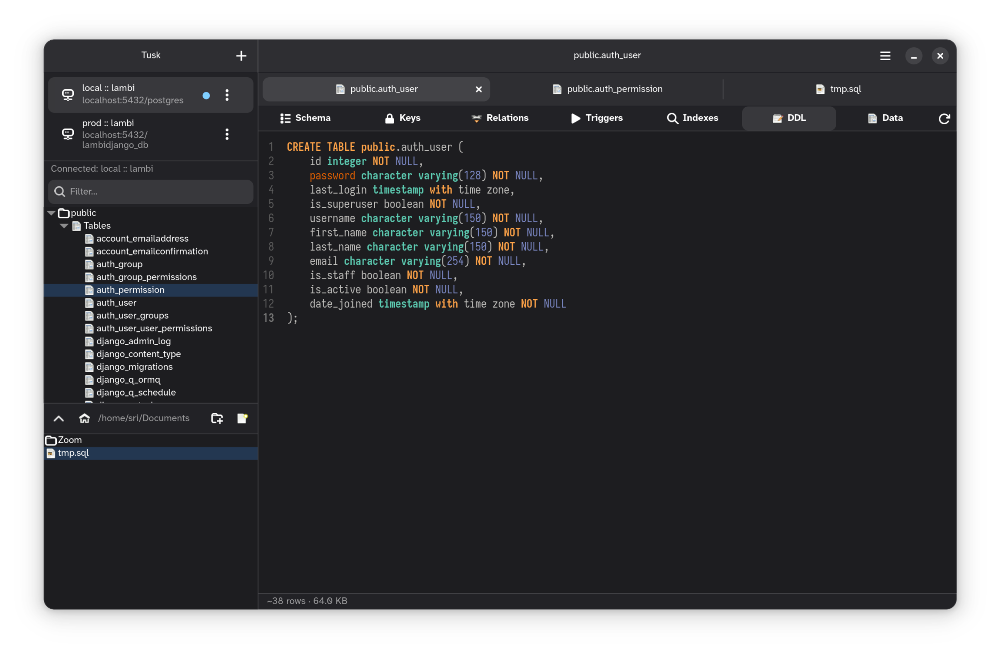
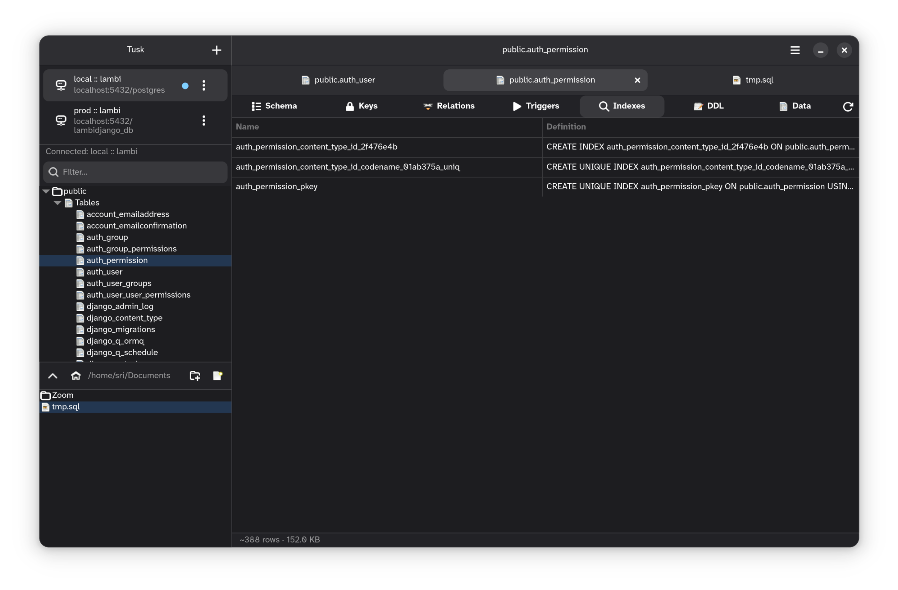
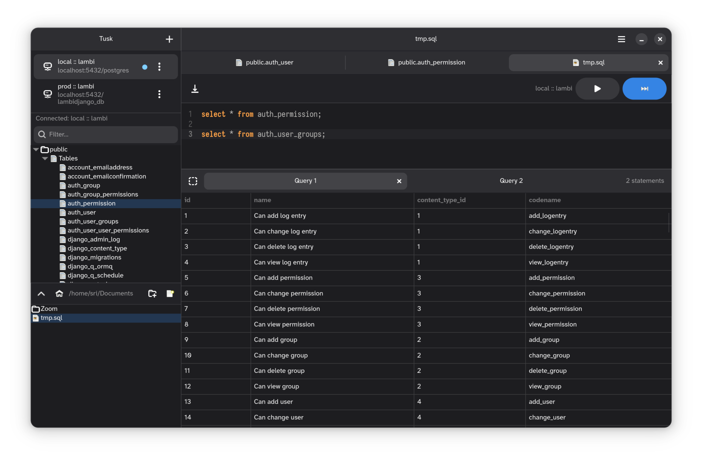
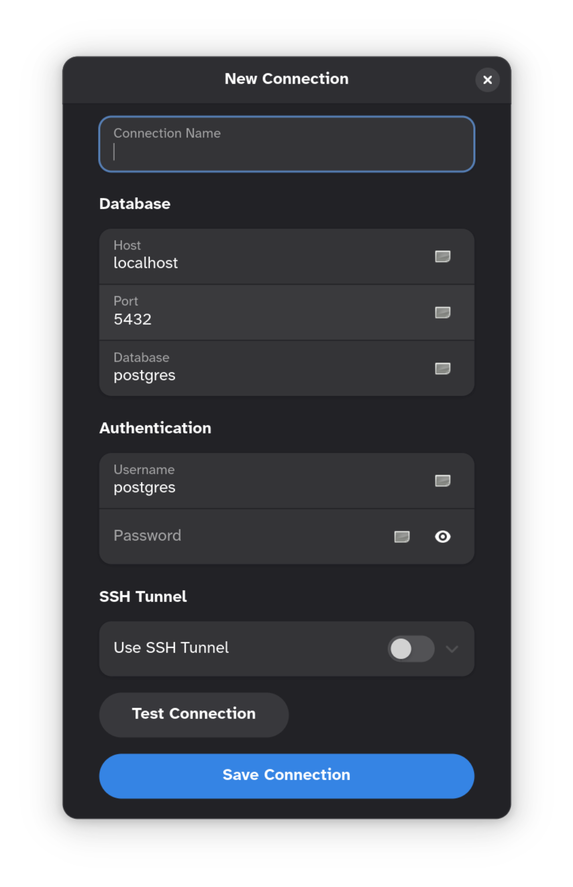
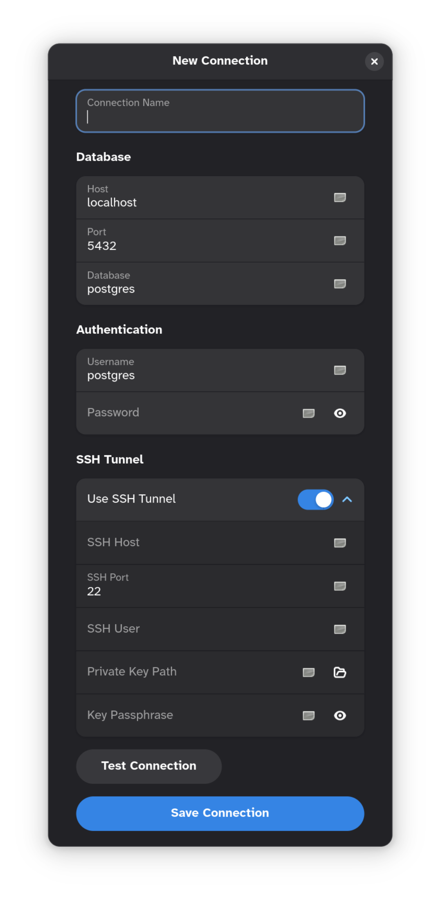
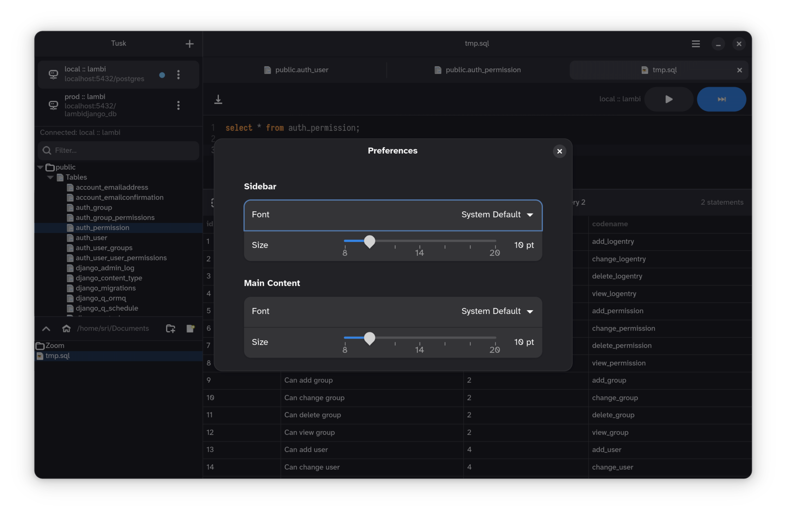
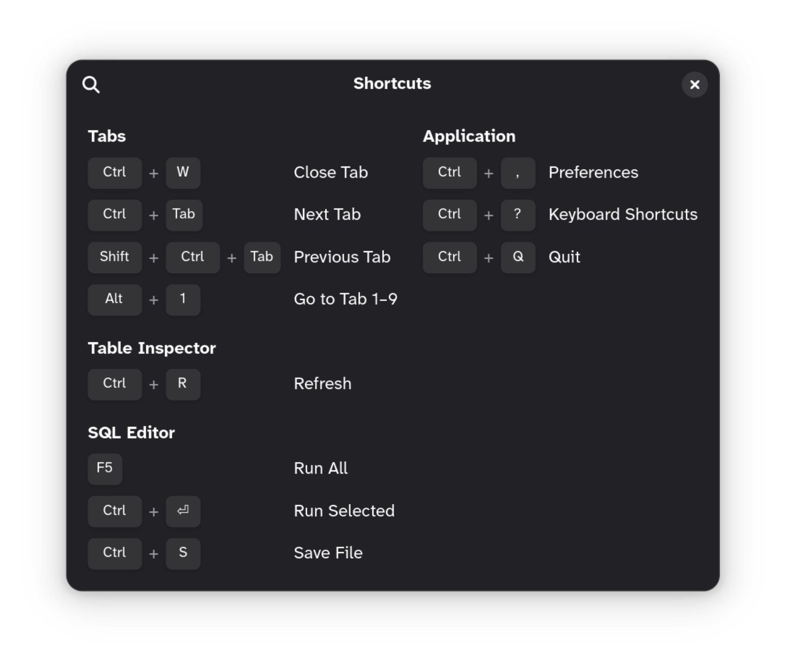

<p align="center">
  
</p>

<h1 align="center">Tusk</h1>
<p align="center">A minimal, clean PostgreSQL client for GNOME.</p>

<p align="center">
  <a href="https://github.com/Shape-Machine/tusk-gnome/releases/latest/download/xyz.shapemachine.tusk-gnome-2026.04.10-01.flatpak"></a>
  <a href="https://github.com/Shape-Machine/tusk-gnome/releases/latest/download/Tusk-2026.04.10-01-x86_64.AppImage"></a>
  <a href="https://github.com/Shape-Machine/tusk-gnome/releases/latest/download/tusk-gnome-2026.04.10-01.deb"></a>
  <a href="https://github.com/Shape-Machine/tusk-gnome/releases/latest/download/tusk-gnome-2026.04.10-01.rpm"></a>
</p>

---

Tusk aims to be the best native PostgreSQL GUI on the GNOME desktop — fast, focused, and out of the way.

See [docs/features.md](docs/features.md) for a full feature overview.

---

## Sponsor

Tusk is free and open source.
If it's useful to you, consider sponsoring its development.

[Sponsor Tusk](https://buy.stripe.com/14A28saQ95kI9q93qNes003)

---

## Screenshots












---

## Sponsor

Tusk is free and open source.
If it's useful to you, consider sponsoring its development.

[Sponsor Tusk](https://buy.stripe.com/14A28saQ95kI9q93qNes003)

---

## Install

**AppImage** — works on any Linux distro:
```bash
chmod +x Tusk-*.AppImage && ./Tusk-*.AppImage
```

**Debian / Ubuntu:**
```bash
sudo apt install ./tusk-gnome-*.deb
```

**Fedora / RHEL:**
```bash
sudo rpm -i tusk-gnome-*.rpm
```

→ [All releases](https://github.com/Shape-Machine/tusk-gnome/releases)

## Dev setup

**Requirements:** Python 3.11+, GTK4, libadwaita ≥ 1.4

```bash
# System deps (Debian/Ubuntu)
sudo apt install python3-venv python3-gi gir1.2-gtk-4.0 gir1.2-adw-1
make apt-deps          # GtkSourceView (syntax highlighting)

# Python deps + run
make deps
make run
```

**Other targets**

| Command          | Description                        |
|------------------|------------------------------------|
| `make run`       | Run from source (no install)       |
| `make install`   | Build with Meson and install       |
| `make uninstall` | Uninstall                          |
| `make clean`     | Remove build artifacts             |
| `make lint`      | Lint with ruff                     |
| `make format`    | Format with ruff                   |
